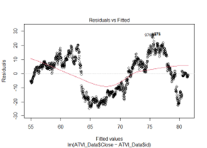
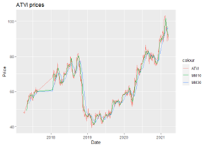

| **Activision Blizzard (ATVI)**   **5 Years of Data**      |
|-----------------------------------------------------------|
|   **Sydney Lieske** -- | 

## Abstract

This project utilizes a five-year dataset of ATVI stocks and employs R for analysis. Our team conducted basic summary statistics, linear regression analysis, and plotted two moving averages of the stock prices for all days since 2017. Our interest in Blizzard games and the company's recent issues inspired us to focus on Blizzard-Activision. We extensively researched and agreed that R would be an effective tool for the project. Notably, we observed a sharp decline in the closing price in 2019, which we attribute to the Hong-Kong issue and delays in releasing key games.

## Introduction

Our team found the topic of this project intriguing due to the potential for insightful data. Our approach involved conducting a linear regression analysis in R using the monthly time index and the closing price. We then plotted the stock price and moving averages for a 10-day and 30-day window using time series data from 2017 onwards. This visualization allowed us to observe the stock's behavior over time, particularly its sharp decline during the company's troubled times.

Our objective was to uncover any patterns in the stocks that might correlate with real-time issues that the company faced. Beyond our shared love for Blizzard games, we were motivated by the larger challenges that the company faced.

## Data

The dataset that we used for this project comes from Yahoo Finance. We had taken the last 5 years of the historical data to use for our analysis. The data included in this dataset are the date, open, high, low, close, adj. close, volume, and we added an ID time index for it. To facilitate time series analysis, we indexed the data.indexed.

## Prior Literature

As part of our research, we investigated potential reasons for the sharp decline in Blizzard-Activision stocks during 2019. We initially overlooked some of the company's internal issues, which we later discovered through further research. Our dataset selection process was streamlined, as we found all the required information on Yahoo Finance. Our research was aimed at enhancing our understanding of the analysis process and the interpretation of the resulting plots.

## Methods

Our decision to use R and RStudio for this project was based on the benefits it provides for data analysis. Most members of our group are proficient in using R, making it a comfortable choice. We opted not to use Excel, as we believed that R would provide us with more comprehensive insights into our dataset.
## Results

Our project could be beneficial to anyone interested in stocks or data analysis. It began with our curiosity, and by the end, we had found intriguing data and connected it to real-world issues. Our linear regression model of monthly close prices against the time index revealed a statistically significant coefficient. We also determined the minimum, mean, and maximum closing prices, which were 68.22, 68.22, and 68.22, respectively.

 
Figure 1 is the residuals vs fitted plot of the linear regression. Linearity is violated.
 
Figure 2: The price and moving averages for all days since 2017, we can see the dip where ATVI plummeted in 2019 and where it starts to build back up.

## References

https://finance.yahoo.com/quote/ATVI/history/
